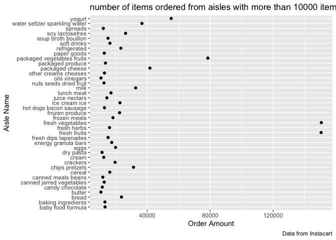
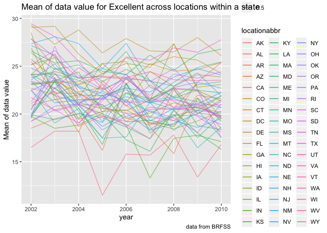
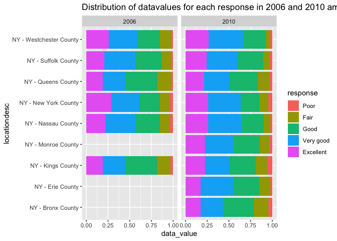
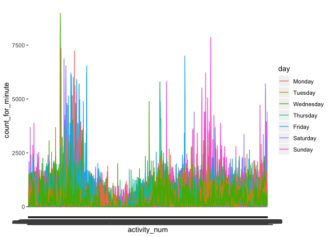

p8105\_hw3\_as5685
================

### Load in “instatcart” dataset

``` r
data("instacart")
nrow(instacart)
```

    ## [1] 1384617

``` r
ncol(instacart)
```

    ## [1] 15

The size of table is 1384617 and 15. Each row in the dataset is a
product from an order, and there is a single order per user.

`product_id` is the product identifier, each id is correspondent to
unique product. For example, if we have the id “49302”, we will know it
is Bulgarian Yogurt in Yougurt aisle.

`product_name` and `aisle` indicate the name of specific product and
which aisle it is placed in the grocery which make easier for sorting
them. such as Fresh Dill belongs to fresh herbs.

Some other variables such as `order_dow`. `order_hour_od_day` and
`reordered` are helpful for staff to do some market research.

### Number of aisles and items ordered

``` r
aisles_data = 
instacart %>% 
  group_by(aisle) %>% 
  summarize(
    aisle_number = n()
  ) %>% 
  arrange(desc(aisle_number))
```

The number of aisles is 134.

Fresh vegatables is the aisle that most item ordered from.

### Plot for number of items ordered

``` r
popularitem_plot = 
    instacart %>% 
      group_by(aisle) %>% 
      summarize(
      order_amount = n()
      ) %>% 
    filter(order_amount > 10000) %>% 
    ggplot(aes(y = aisle, x = order_amount)) +
      geom_point() +
      labs(
        title = "number of items ordered from aisles with more than 10000 items",
        y = "Aisle Name",
        x = "Order Amount",
        caption = "Data from Instacart"
      )
popularitem_plot
```

<!-- -->
Among the aisles with more than 10000 orders, fresh vegatables and fresh
fruits are the most popular aisles.

oils, vinegars or butter aisle is least popular among the list.

### Table showing three most popular items in each aisle

``` r
popularitem_data =
  instacart %>% 
   group_by(aisle, product_name) %>% 
  filter(aisle %in% c("baking ingredients", "dog food care", "packaged vegetables fruits")) %>% 
  summarize(
    product_order_amount = n()
  ) %>% 
  filter(min_rank(desc(product_order_amount)) < 4) %>% 
  arrange(desc(product_order_amount)) %>% 
  knitr::kable()

popularitem_data 
```

| aisle                      | product\_name                                 | product\_order\_amount |
| :------------------------- | :-------------------------------------------- | ---------------------: |
| packaged vegetables fruits | Organic Baby Spinach                          |                   9784 |
| packaged vegetables fruits | Organic Raspberries                           |                   5546 |
| packaged vegetables fruits | Organic Blueberries                           |                   4966 |
| baking ingredients         | Light Brown Sugar                             |                    499 |
| baking ingredients         | Pure Baking Soda                              |                    387 |
| baking ingredients         | Cane Sugar                                    |                    336 |
| dog food care              | Snack Sticks Chicken & Rice Recipe Dog Treats |                     30 |
| dog food care              | Organix Chicken & Brown Rice Recipe           |                     28 |
| dog food care              | Small Dog Biscuits                            |                     26 |

The most populat three items in `packaged vegetabels fruits` are
`organic baby spinach` with 9784 ordered, `organic raspberreis` with
5546 ordered, and `organic blueberries` with 4966 ordered.

The most popular three items in `baking ingredients` are `Cane Sugar`
with 336 ordered, `Light Brown Sugar` with 499 ordered and `Pure Baking
Soda` with 387 ordered.

The most popular three items in `dog food care` are `organix Chicken &
Brown Rice Recipe` with 28 ordered `Small dog biscuits`with 26 ordered
`Snack Sticks Chicken & Rice Recipe Dog Treats` with 30
ordered.

### Mean hour of the day at which Pink Lady Apples and Coffee Ice Cream are ordered on each day of the week

``` r
meanhours_data = 
instacart %>% 
  group_by(product_name,order_dow) %>% 
    filter(product_name %in% c("Pink Lady Apples", "Coffee Ice Cream")) %>% 
  summarize(meanhours = mean(order_hour_of_day)) %>% 
  pivot_wider(
    names_from = "order_dow",
    values_from = "meanhours"
  ) %>% 
knitr::kable(digits = 1) 
meanhours_data
```

| product\_name    |    0 |    1 |    2 |    3 |    4 |    5 |    6 |
| :--------------- | ---: | ---: | ---: | ---: | ---: | ---: | ---: |
| Coffee Ice Cream | 13.8 | 14.3 | 15.4 | 15.3 | 15.2 | 12.3 | 13.8 |
| Pink Lady Apples | 13.4 | 11.4 | 11.7 | 14.2 | 11.6 | 12.8 | 11.9 |

For coffee Ice Cream, on order\_dow0 and order\_dow6 has the lowest mean
of order hour of the day.

For Pink Lady Apples, the lowest mean of order hour of the day is
order\_dow1. Details have been shown in above table.

## Problem 2

### Load and read in data “BRFSS”

``` r
data("brfss_smart2010")
```

### Data cleaning

``` r
brfss_dataclean = 
  brfss_smart2010 %>% 
  janitor::clean_names() %>% 
  filter(topic == "Overall Health") %>% 
  filter(response %in% c("Excellent","Fair","Good","Poor","Very good")) %>% 
  mutate(
    response = factor(response, levels = c("Poor","Fair","Good","Very good","Excellent")) 
    ) 
```

### States obseved at 7 or more.

``` r
location_count_2002 = 
brfss_dataclean %>% 
   filter(year %in% c("2002","2010")) %>% 
    group_by(year, locationabbr) %>%
    summarize(
      state_n = n(),
      location_n = n_distinct(locationdesc)
    ) %>% 
  mutate(greatherthan7 = location_n >= 7) %>% 
  filter(greatherthan7 == "TRUE")
```

In 2002, “NJ”, “PA”,“NC”, “MA”, “FL”,“CT” is the state obeserved at 7
locations.

In 2010, “CA”,“FL”,“CO”,“MA”,“MD”,“NC”,“NE”,“NJ”,“NY”,“OH”,“PA”,
“SC”,“TX”,“WA” are the states observed at 7 or more locations.

### spaghetti plot

``` r
excellent_datasets = 
  brfss_dataclean %>%
  group_by(locationabbr,year) %>% 
  filter(response == "Excellent") %>% 
  mutate(
    datavalue_mean = mean(data_value, na.rm = TRUE)
  ) %>% 
  select(year, locationabbr, datavalue_mean,response) %>% 
  distinct()

spaghetti_plot = 
  ggplot(data = excellent_datasets, aes(x = year, y = datavalue_mean, color = locationabbr, alpha = 0.5)) +
  geom_line() +
  labs(
    title = "Mean of data value for Excellent across locations within a state",
    y = "Mean of data value",
    caption = "data from BRFSS"
  )
spaghetti_plot
```

<!-- -->

Based on the dataset and plot, it can be found that the trends of mean
of data values for excellence across the year are different for each
states.

Most them have lower mean in 2010 than 2002.

### Two-panel plots for 2006 and 2010(poor to excellent)

``` r
plot = 
  brfss_dataclean %>% 
  filter(year %in% c("2006","2010"), locationabbr == "NY") %>% 
  select(response,year,locationdesc,data_value) %>% 
  ggplot(aes(x = data_value,y = response, fill = response, alpha = 0.5)) + 
    geom_density_ridges() +
    facet_grid(.~year) +
    viridis::scale_fill_viridis(discrete = TRUE) +
  labs(
    title = "Distribution of datavalues for each response in 2006 and 2010"
  )
plot 
```

    ## Picking joint bandwidth of 2.1

    ## Picking joint bandwidth of 2.03

<!-- -->

The distribution of “poor” and “very good” are similar between 2006 and
2010 in NY . The value range for fair in 2010 is larger than 2006. For
“Very good” and “Excellent”, the mean value is larger in 2010 than
2006.

## problem 3

### load, tidy and wrangle the data

``` r
CHF_data = 
  read_csv("./p8105_hw3_as5685_files/accel_data.csv") %>% 
  janitor::clean_names() %>% 
  
  mutate(
    day = factor(day, levels = c("Monday","Tuesday","Wednesday","Thursday","Friday","Saturday", "Sunday")),
    weekday_or_weekend = ifelse(day %in% c("Saturday", "Sunday"), "weekend", "weekday")
  ) %>% 
    select(week,day_id,day,weekday_or_weekend,everything()) %>% 
      
  pivot_longer(
    activity_1:activity_1440, 
    names_to = "activity_num",
    values_to = "count_for_minute")
```

    ## Parsed with column specification:
    ## cols(
    ##   .default = col_double(),
    ##   day = col_character()
    ## )

    ## See spec(...) for full column specifications.

I used `pivot_longer` to organize the table. The variables are `week`,
`day_id`, `day`, `weekday_or_weekend`, `activity number` and
`count_for_minute`. I transfer variables of days into factor and relevel
them. All orginially observed variables are kept.

In the new dataset, the number of observation is 50400 and
6.

### Aggregate accross minutes to create a total activity variable for each day, and create a table showing these totals.

``` r
totalactivity_data = 
  CHF_data %>% 
  group_by(day_id) %>% 
  mutate(
   day_total_activity = sum(count_for_minute)
  ) %>% 
  select(day_id,day_total_activity) %>% 
  distinct() %>% 
  knitr::kable()
totalactivity_data
```

| day\_id | day\_total\_activity |
| ------: | -------------------: |
|       1 |            480542.62 |
|       2 |             78828.07 |
|       3 |            376254.00 |
|       4 |            631105.00 |
|       5 |            355923.64 |
|       6 |            307094.24 |
|       7 |            340115.01 |
|       8 |            568839.00 |
|       9 |            295431.00 |
|      10 |            607175.00 |
|      11 |            422018.00 |
|      12 |            474048.00 |
|      13 |            423245.00 |
|      14 |            440962.00 |
|      15 |            467420.00 |
|      16 |            685910.00 |
|      17 |            382928.00 |
|      18 |            467052.00 |
|      19 |            371230.00 |
|      20 |            381507.00 |
|      21 |            468869.00 |
|      22 |            154049.00 |
|      23 |            409450.00 |
|      24 |              1440.00 |
|      25 |            260617.00 |
|      26 |            340291.00 |
|      27 |            319568.00 |
|      28 |            434460.00 |
|      29 |            620860.00 |
|      30 |            389080.00 |
|      31 |              1440.00 |
|      32 |            138421.00 |
|      33 |            549658.00 |
|      34 |            367824.00 |
|      35 |            445366.00 |

There is no apparent trend across the 35 days. Overall, the activity
counts are similar for each weekend, and relatively lower at the
mid-week.

### Single-panel plot

``` r
activity_plot = 
  CHF_data %>% 
  ggplot(aes(x = week, y = count_for_minute, color = day)) +
  geom_point()
activity_plot
```

<!-- -->

TOTAL ACTIVITY EACH DAY or ACITIVITY COUNT PER MINUTES.
